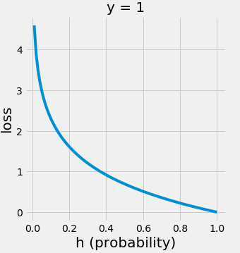
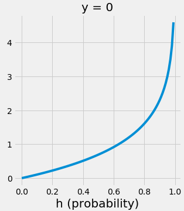

# Cost Function of Logistic Regression
The cost function of logistic regression is as follows:

$$
J(w) = -\frac{1}{m} \sum_{i=1}^{m}[y^{(i)}log(\sigma(z^{(i)})) + (1-y^{(i)})log(1-\sigma(z^{(i)}))]
$$

+ w: weights
+ $y^{(i)}$: the classification of the i-th data sample (0 or 1)
+ $z^{(i)}$: the log-odds of the i-th data sample
+ $\sigma(z^{(i)})$: the sigmoid of the log-odds of the i-th data sample (i.e., the probability that the i-th data sample belongs to the classification)

Why does the cost function look like this?
To understand this, we first need to understand the concept of log-odds.

# What is Log-Odds?
## What is Odds?
In linear regression, the prediction values range from $-\infin$ to $\infin$.
In logistic regression, however, there is a key difference: instead of predicting a value directly, it calculates a **log-odd**.

$$
odds = \frac{P(event \,occurring)}{P(event \,not \,occurring)} = \frac{P(y=1|x)}{1-P(y=1|x)} = \frac{p}{1-p}
$$

However, since the odds range from [0, $\infin$] and are asymmetric, they are difficult to use as-is.

## What is Logit (=Log-Odds)?
To address this, a log function is applied as follows:

$$
logit(p) = log(odds) =  log\frac{p}{1-p}
$$

However, Logit still has a range of [$-\infin$, $\infin$], which makes it unsuitable for direct use as probabilities.

## Logistic Function (=Sigmoid Function)
The sigmoid function is used to map the range to [0, 1], making it suitable for representing probabilities.
Let $\eta = logit(p)$, then:

$$
\sigma(\eta) = \frac{1}{1+\exp(-\eta)}
$$

The sigmoid function helps transform the logit into a probability range. For better understanding, let’s illustrate this with a graph:

This process leads to the well-known sigmoid function graph.
Now, we have some understanding of what $\sigma(z^{(i)})$ means.
But what does $-log(\sigma(z^{(i)}))$ represent?

# What does $-log(\sigma(z^{(i)}))$ represent?
Let’s plot the graph of $y=-log(x)$ (with log = ln):

Since $\sigma(z^{(i)})$ ranges from [0, 1], it looks like this:

The closer the prediction is to 1, the smaller the value of $-log(\sigma(z^{(i)}))$. Conversely, the further the prediction is from 1, the larger the value.
In other words, this represents a **loss function**: the worse the prediction, the higher the loss.

(Note that the cost function is the average of the loss functions across the entire dataset.)

$$
L(w) = y^{(i)}log(\sigma(z^{(i)})) + (1-y^{(i)})log(1-\sigma(z^{(i)}))
$$

$$
J(w) = \frac{1}{m}\sum_{i=1}^{m}L(w) = -\frac{1}{m} \sum_{i=1}^{m}[y^{(i)}log(\sigma(z^{(i)})) + (1-y^{(i)})log(1-\sigma(z^{(i)}))]
$$

Similarly, $-log(1-\sigma(z^{(i)}))$ can be considered the loss function when predicting 0.

Thus, for all m data samples:
When a sample belongs to class 1, add $-log(\sigma(z^{(i)}))$.
When a sample belongs to class 0, add $-log(1-\sigma(z^{(i)}))$.
This gives the total loss value.

Hence, the following equation holds:

$$
J(w) = -\frac{1}{m} \sum_{i=1}^{m}[y^{(i)}log(\sigma(z^{(i)})) + (1-y^{(i)})log(1-\sigma(z^{(i)}))]
$$

# References
- https://velog.io/@hyesoup/로지스틱-회귀-Logistic-Regression
- https://soobarkbar.tistory.com/12
- https://lucy-the-marketer.kr/ko/growth/logistic-regression/