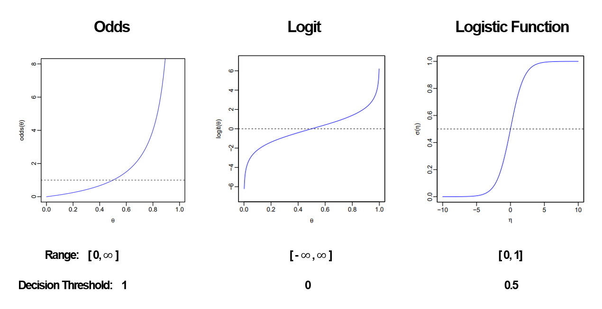
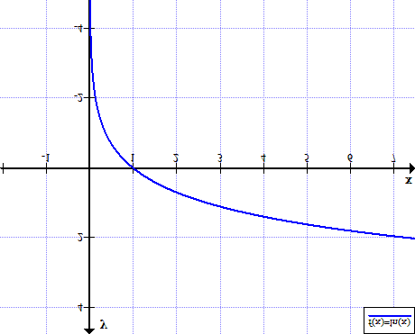
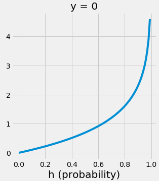

# 로지스틱 회귀의 비용함수
로지스틱 회귀의 비용함수는 다음과 같이 생겼다.

$$
J(w) = -\frac{1}{m} \sum_{i=1}^{m}[y^{(i)}log(\sigma(z^{(i)})) + (1-y^{(i)})log(1-\sigma(z^{(i)}))]
$$

+ w: 가중치
+ $y^{(i)}$: i번째 데이터 샘플의 분류(0 혹은 1)
+ $z^{(i)}$: i번째 데이터 샘플의 log-oddo
+ $\sigma(z^{(i)}))$: i번째 데이터 샘플의 log-odd의 sigmoid (즉, i번째 데이터 샘플이 분류에 속할 확률)

그렇다면 비용함수는 왜 이렇게 생겨 먹은걸까?
이를 이해하기 위해서는 log-odd에 대해서 먼저 이해해야 한다.
# log-odd란 뭘까?
## Odds란?
선형 회귀에서는 $-\infin$ ~ $\infin$ 의 예측값을 반환한다.
로지스틱 회귀에서는 마지막 예측값 대신 **log-odd**라는 걸 구해야 한다는 차이가 있다.
$$
odds = \frac{P(event \,occurring)}{P(event \,not \,occurring)} = \frac{P(y=1|x)}{1-P(y=1|x)} = \frac{p}{1-p}
$$
하지만 Odds는 범위가 [0,$\infin$]이고, 비대칭성이기 때문에 사용하기 어렵다.
## Logit (=Log-odds)란?
이를 해결하기 위해 다음과 같이 로그함수를 취한다.
$$
logit(p) = log(odds) =  log\frac{p}{1-p}
$$
하지만 Logit은 확률로 사용하기 어려운 치역 범위 [$-\infin$,$\infin$]를 갖고 있기 때문에 마찬가지로 사용하기 어렵다.
## Logistic Function (=시그모이드 함수)
치역의 범위를 확률로 사용하기 좋게 [0,1]로 바꾸도록 도와주는 것이 이 시그모이드 함수이다.
$\eta = logit(p)$ 라 할 때
$$
\sigma(\eta) = \frac{1}{1+\exp(-\eta)}
$$
위와 같이 시그모이드 함수를 취한다.
이해하기 쉽게 그림으로 설명하자.

이러한 과정을 거쳐서 우리에게 익숙한(?) 시그모이드 함수의 그래프가 나온다.
이제 $\sigma(z^{(i)})$가 무엇을 의미하는지 대충 이해한 듯 하다. 그렇다면 $-log(\sigma(z^{(i)}))$는 무슨 의미일까?
# $-log(\sigma(z^{(i)}))$ 는 뭘 의미할까
$y=-log(x)$ 그래프를 한 번 그려보자. (단 log = ln이다.)

여기서 $\sigma(z^{(i)})$는 [0,1] 이므로 아래와 같다.

1임을 예측할수록 $-log(\sigma(z^{(i)}))$ 값이 줄어들고, 1임을 예측하지 못할수록 값이 커진다.
즉, 예측을 잘못할수록 값이 커진다. 이는 손실함수라고 말할 수 있을 것이다.

(참고로 비용함수는 모든 데이터셋의 손실함수에 대한 평균이다.)

$$
L(w) = y^{(i)}log(\sigma(z^{(i)})) + (1-y^{(i)})log(1-\sigma(z^{(i)}))
$$

$$
J(w) = \frac{1}{m}\sum_{i=1}^{m}L(w) = -\frac{1}{m} \sum_{i=1}^{m}[y^{(i)}log(\sigma(z^{(i)})) + (1-y^{(i)})log(1-\sigma(z^{(i)}))]
$$

그렇다면 $-log(1-\sigma(z^{(i)}))$도 같은 방식으로 0임을 예측하는 것의 손실함수라고 말할 수 있을 것이다.

따라서 모든 m개의 데이터 샘플에 대하여
데이터 샘플의 분류가 1일 때는 $-log(\sigma(z^{(i)}))$를 더하고,
데이터 샘플의 분류가 0일 때는 $-log(1-\sigma(z^{(i)}))$를 더하면 전체 손실값이 될 것이라는 것을 알 수 있다.

따라서 아래와 같은 식이 성립한다.
$$
J(w) = -\frac{1}{m} \sum_{i=1}^{m}[y^{(i)}log(\sigma(z^{(i)})) + (1-y^{(i)})log(1-\sigma(z^{(i)}))]
$$
# 참고
- https://velog.io/@hyesoup/로지스틱-회귀-Logistic-Regression
- https://soobarkbar.tistory.com/12
- https://lucy-the-marketer.kr/ko/growth/logistic-regression/
